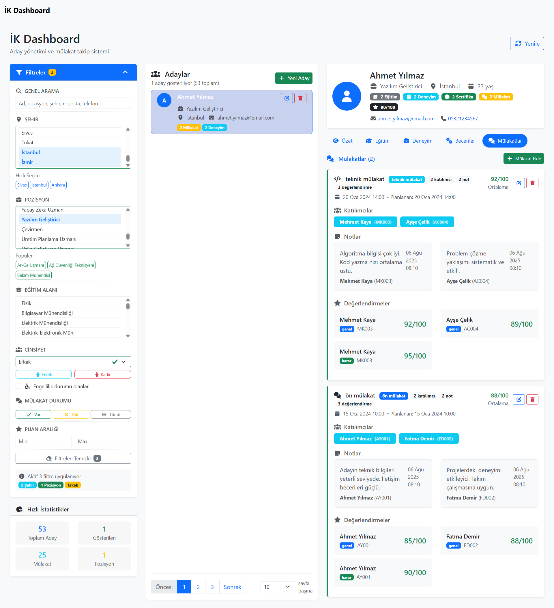
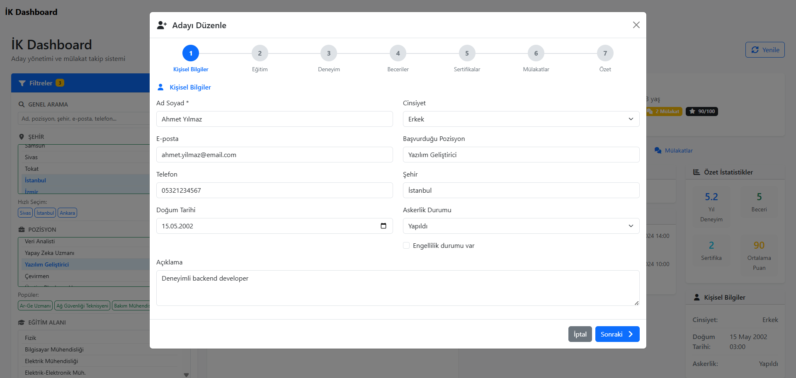
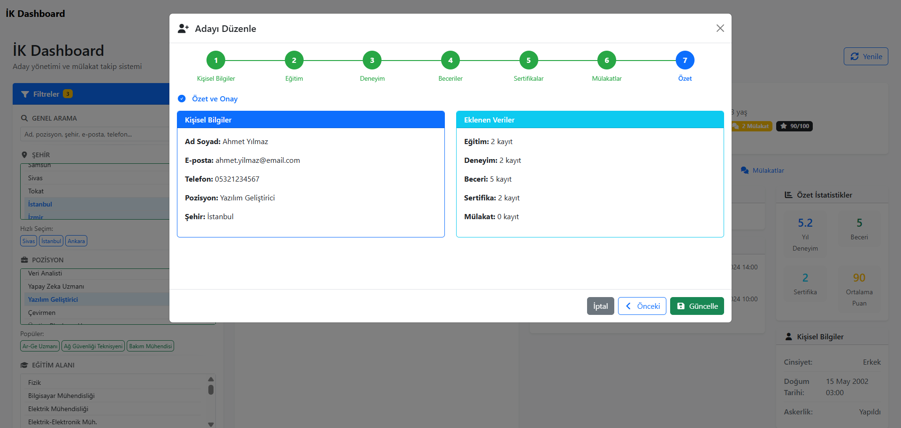
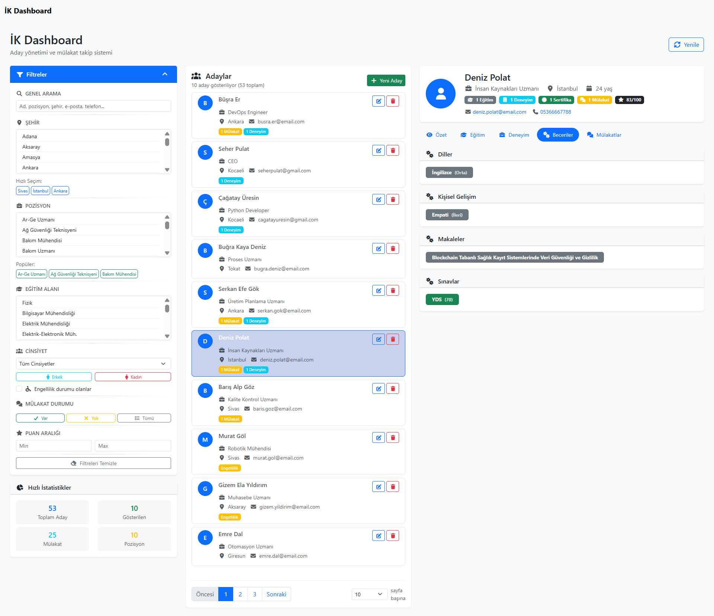

# İş Başvuru & Mülakat Takip Sistemi

Bu proje, iş başvurularınızı ve mülakat süreçlerinizi kolayca takip edebilmeniz için geliştirilmiş tam yığın (full-stack) bir web uygulamasıdır. Proje iki ana bölümden oluşmaktadır: **Frontend (Angular)** ve **Backend (Node.js/Express)**.

---

## İçerik

- [Özellikler](#özellikler)
- [Kurulum](#kurulum)
  - [Backend Kurulumu](#backend-kurulumu)
  - [Frontend Kurulumu](#frontend-kurulumu)
- [Docker ile Çalıştırma](#docker-ile-çalıştırma)
- [Klasör Yapısı](#klasör-yapısı)
- [Lisans](#lisans)

---

## Özellikler

- Aday (Kişi) ekleme, listeleme ve detay görüntüleme
- Mülakat ve değerlendirme yönetimi
- Notlar, sertifikalar, tecrübeler ve okullar gibi aday bilgilerini takip etme
- Filtreleme ve arama özellikleri
- Modern ve kullanıcı dostu arayüz

---

## Ekran Görüntüleri

Aşağıda uygulamadan bazı ekran görüntüleri bulunmaktadır:






## Kurulum

### Backend Kurulumu

1. `backend` klasörüne gidin:
    ```sh
    cd backend
    ```
2. Bağımlılıkları yükleyin:
    ```sh
    npm install
    ```
3. Ortam değişkenlerini ayarlayın:
    - `.env.example` dosyasını `.env` olarak kopyalayıp gerekli bilgileri doldurun.
4. Veritabanı migrasyonlarını çalıştırın (gerekirse):
    ```sh
    npx sequelize-cli db:migrate
    ```
5. Sunucuyu başlatın:
    ```sh
    npm start
    ```
    veya
    ```sh
    node app.js
    ```

### Frontend Kurulumu

1. `frontend` klasörüne gidin:
    ```sh
    cd frontend
    ```
2. Bağımlılıkları yükleyin:
    ```sh
    npm install
    ```
3. Uygulamayı başlatın:
    ```sh
    ng serve
    ```
    veya
    ```sh
    npm start
    ```
4. Tarayıcınızdan [http://localhost:4200](http://localhost:4200) adresine gidin.

---

## Docker ile Çalıştırma

Her iki proje için de `Dockerfile` ve `.dockerignore` dosyaları hazırdır.
y
### Backend için:
```sh
cd backend
docker build -t is-basvuru-backend .
docker run -p 3000:3000 --env-file .env is-basvuru-backend
```

### Frontend için:
```sh
cd frontend
docker build -t is-basvuru-frontend .
docker run -p 80:80 is-basvuru-frontend
```

---

## Klasör Yapısı

```
repo/
├── backend/
│   ├── app.js
│   ├── config/
│   ├── controllers/
│   ├── models/
│   ├── routes/
│   ├── migrations/
│   ├── seeders/
│   ├── .env
│   ├── Dockerfile
│   └── ...
├── frontend/
│   ├── src/
│   ├── angular.json
│   ├── Dockerfile
│   └── ...
└── LICENSE
```

---

## Lisans

Bu proje [MIT Lisansı](./LICENSE) ile lisanslanmıştır.

---

Her türlü